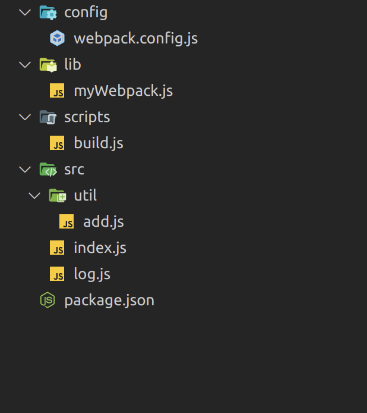

#### 什么是 Tree Shaking

Tree Shaking 是 DCE(Dead Code Elimination) 的一种实现,即清除无用代码,这个功能最早是在 Rollup 中实现的,随后 webpack 在 2.0 版本中也实现了此功能

#### 基本使用

```json
module.exports = {
  mode: "production",
  optimization: {
    usedExports: true,
  },
};
```

webpack4 添加了 sideEffects 配置属性,用于声明那些模块是没有副作用的,从而可以安全的移除.

如上面的例子中模块中包含两个纯函数,所以可以设置 sideEffects 为 `false`, 可以安全的删除 `square`

```json
{
  "name": "your-project",
  "sideEffects": false
}
```

sideEffects 可能会比 usedExports 更加有效,因为它是声明式的告诉,那些模块/文件可以跳过.

usedExports 依赖 terser 来检测语句中的副作用。对于如下的模块,默认不会被移除,因为不确定其中是否有副作用.虽然可以使用标注来解决,但是 sideEffect 使用的更多.

```js
// a.js
class A {}
Array.prototype.slice = () => {};
// 表示一个无副作用的模块,可以删除
export default /*#__PURE__*/ A;
```

#### 实现原理

Make 阶段，收集模块导出变量并记录到模块依赖关系图 ModuleGraph 变量中
Seal 阶段，遍历 ModuleGraph 标记模块导出变量有没有被使用
生成产物时，若变量没有被其它模块使用则删除对应的导出语句

##### Make 收集阶段

这个阶段需要分析每个文件中有那些模块被导出,把这些导出模块转换为 webpack 内部对象,并添加到当前模块依赖中

```js
export const bar = "bar";
export const foo = "foo";

export default "foo-bar";
```

最终转换为三个内部对象



在编译结束之后会触发回调,这时会遍历 dependencies 数组,找到所有的导出对象转换为 ExportInfo 记录在 ModuleGraph 中,至此 webpack 可以直接访问各模块的导出值.

##### Seal 标记阶段

标记的主要作用就是**删除没有使用模块的导出语句**,可以看见对于导出但是没有使用的模块会添加未使用的标记,并且不会被导出,但是**标记阶段不会删除代码,删除的过程是 Terser 等压缩工具实现的**

```js
/***/ (function (module, __webpack_exports__, __webpack_require__) {
  "use strict";
  /* unused harmony export square */
  /* harmony export (immutable) */ __webpack_exports__["a"] = cube;
  function square(x) {
    return x * x;
  }

  function cube(x) {
    return x * x * x;
  }
});
```

这一阶段会触发 `optimizeDependencies`,从 entry 入口文件开始遍 ModuleGraph 所有的模块

接着遍历所有 exportInfo 数组,为每一个 exportInfo 执行 `getDependencyReferencedExports` 方法，确定其对应的 dependency 对象有否被其它模块使用

被任意模块使用到的导出值，调用 exportInfo.setUsedConditionally 方法将其标记为已被使用,内部修改 `exportInfo._usedInRuntime` 记录导出如何被使用

这一过程是通过 FlagDependencyUsagePlugin 插件完成的

##### 生成代码

调用 `HarmonyExportXXXDependency.Template.apply` 生成代码,方法内部会读取 exportsInfo, 分别为使用和未使用的导出值创建不同的 `HarmonyExportInitFragment`, 保存到 `initFragments` 数组并循环生成代码.

最终的的无用代码会被压缩工具删除.

#### 对比 Rollup

与 webpack 相同 Rollup 也是基于 ES 模块化做静态分析, 但是由于[打包方式不同](/posts/2c68ca6b0823/),Rollup 的打包文件在同一作用域下,所以还可以进行流程分析.

Rollup 可以**删除被引用但是没有使用**的模块,但也不是所有的副作用 Rollup 都可以处理,包括:

未使用的 class 中的方法(可以通过 enhancement 配置解决)

对全局对象的赋值 `window.a = 1`

#### 最佳实践

- 避免无意义的赋值语句

```js
// math.js
export const a = 1;
export const b = 2;

// index.js
import { a, b } from "./index";
const f = a;
```

通过静态分析只能判断:**模块导出变量是否被其它模块引用,或引用模块的主体代码中有没有出现这个变量**

另外最重要的是因为 JS 这种动态类型语言引用的 `a` 可能存在副作用

- 必要的时候使用 `/*__PURE__*/` 纯函数标注

- 禁用 babel 的导入导出语句转换

  当 babel 的 module 配置为 commonjs 的时候,将不能正确识别未使用的模块

  ```js
  presets: [
    "babel-preset-env",
    {
      modules: "commonjs",
    },
  ];
  ```

- 将"sideEffects"属性添加到项目 package.json 文件中。

- 使用明确的导出语句

```js
export default {
  bar: "bar",
  foo: "foo",
};

//  修改为
export bar;
export foo;
```

- 使用支持 Tree Shaking 的工具包

例如:使用 lodash-es 替代 lodash ，或者使用 babel-plugin-lodash 实现类似效果
