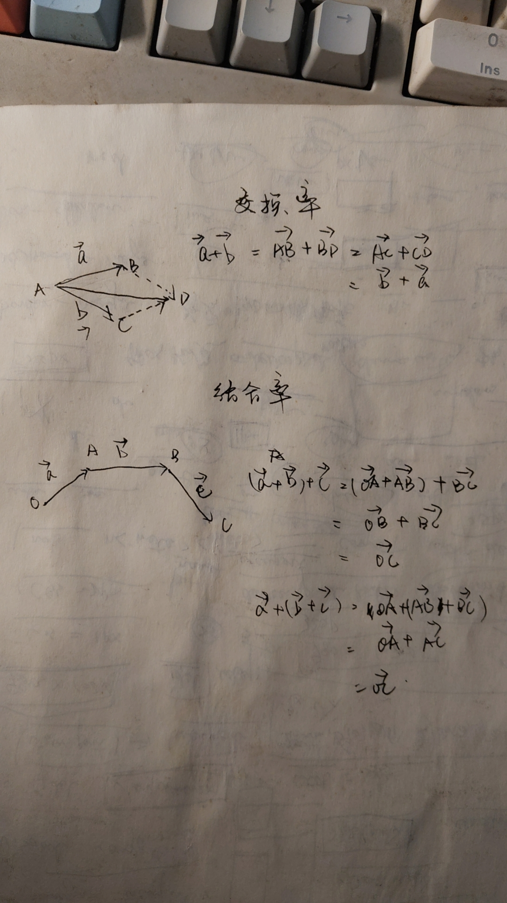
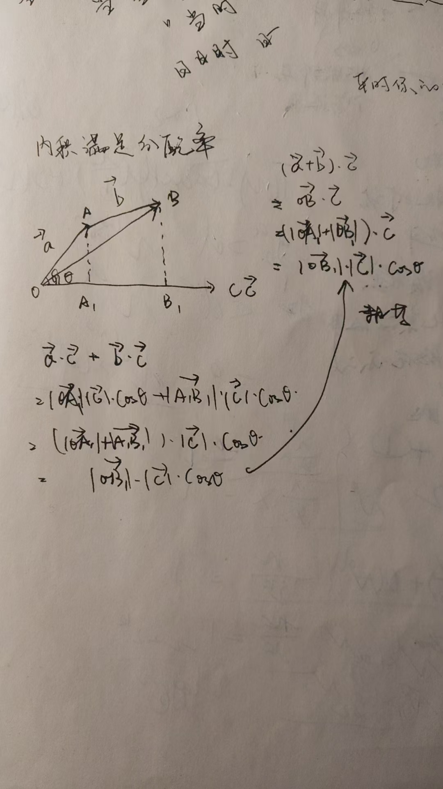
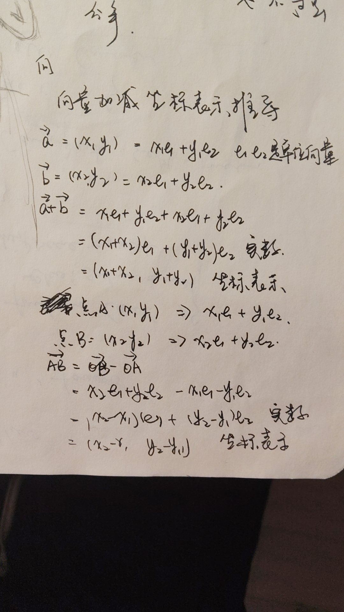
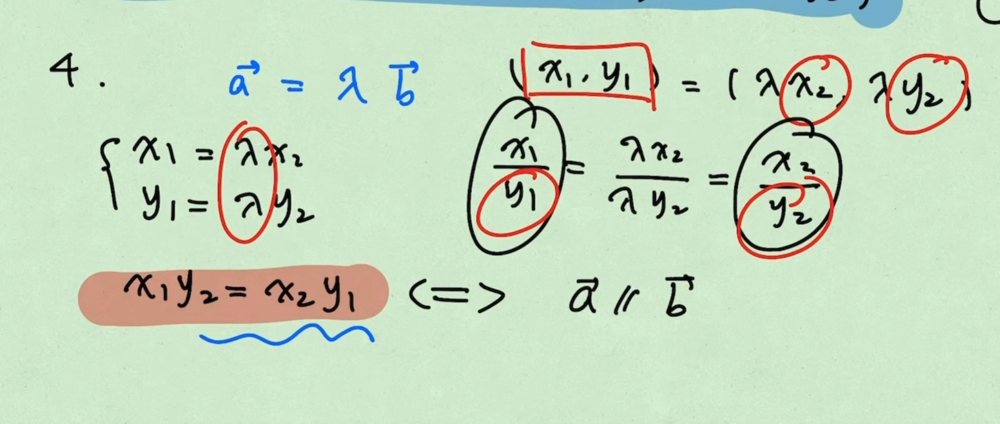
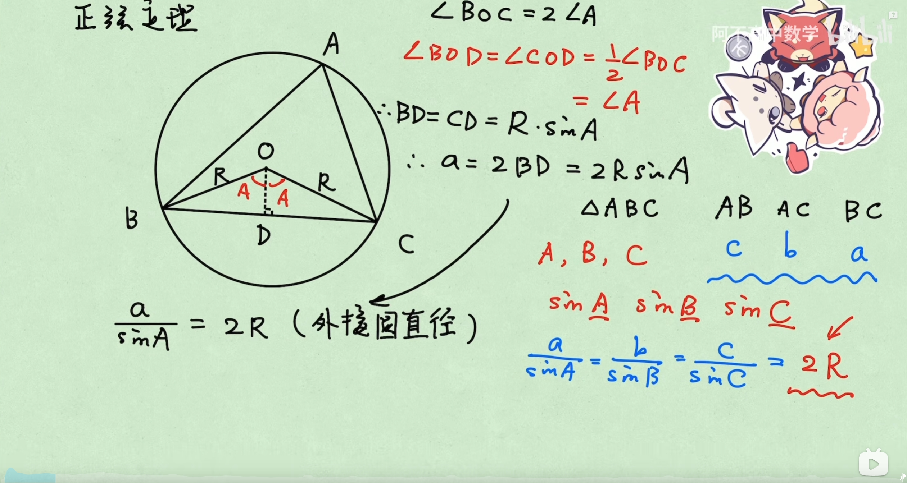
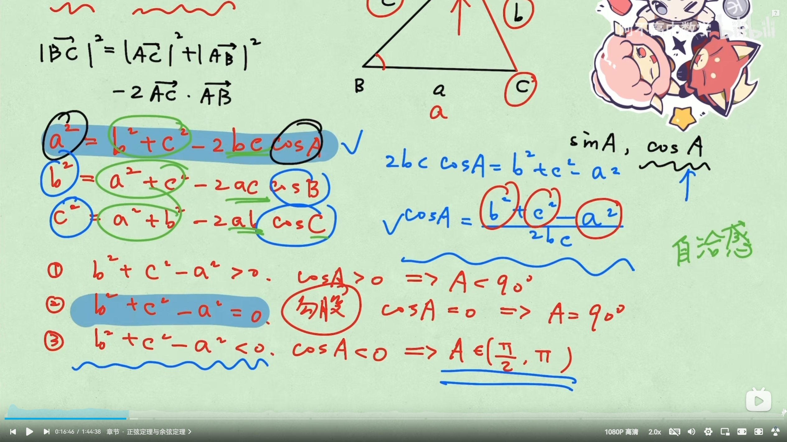
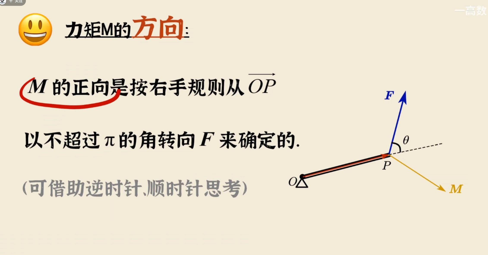
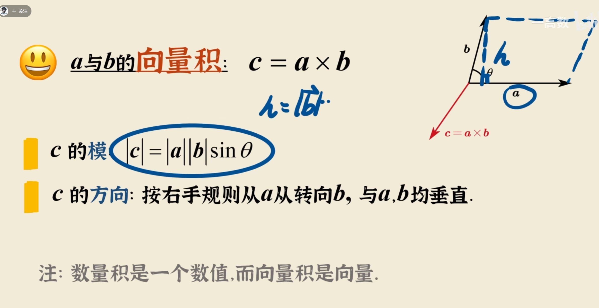
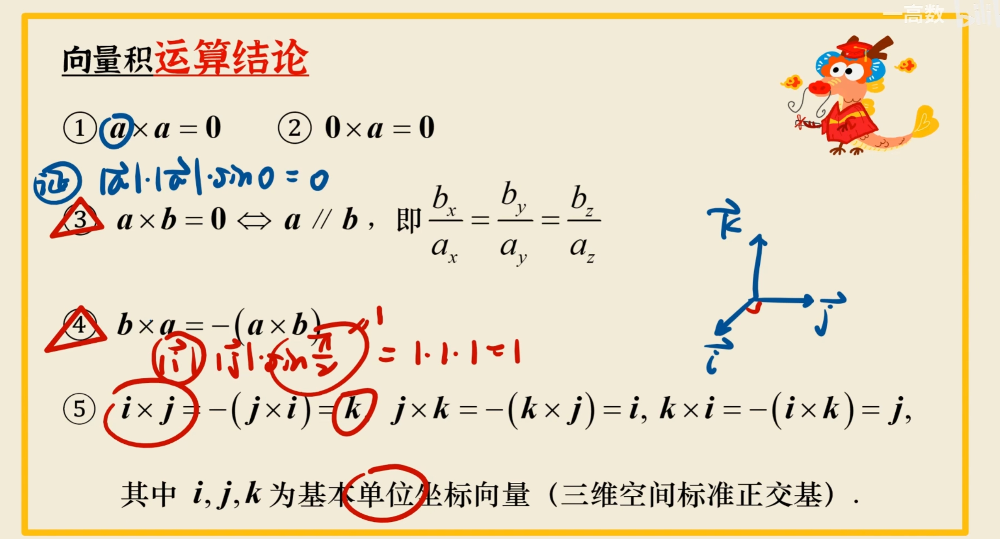
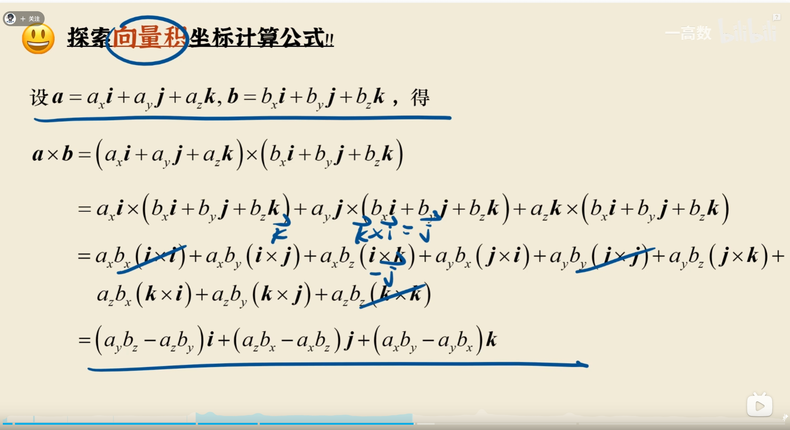

#### 向量

向量不能比较大小，模长可以比较大小

- 几何中用有向线段表示 **向量**
- 零向量
  和所有向量都平行
- 单位向量
  a/|a|
- 平行向量
  方向相同或相反
- 向量加减法的几何意义是位移相同
  **不要死记硬背公式，用图形去推导**
  三角形法则，平行四边形法则，两种方法通用不分场景
- 交换律 结合率
  
- 两边之和大于第三边 两边之差小于第三边
  |a 向量| + |b 向量| >= |a 向量+b 向量| 等号在方向相同的时候可以取到（注意不能是平行）

有向线段表示向量 AM AN,如果向量不相等那么，MN 不重合是正确的

a//b b//c 那么 a//c 这是错误的，因为中间可能是 0 向量

判断 p 是 q 的什么条件，这种提就是正着推一遍，反着推一遍

- p: a 与 b 平行 q：a 与 b 共线 充要条件，通常用“共线”来描述方向一致或平行的关系，即使它们的起点不同。在这种情况下，通常会将一个向量“位移”到与另一个向量的起点相同的位置，便于分析

- 数乘
  一个实数乘以向量
  非零向量 a b 共线 => b = xa;
- 数量积 点积 内积
  是一个人为的定义，表示物体的做功，值是一个实数
  a.b = |a|.|b|.cosΘ

  柯西不等式：
  |a.b| = |a|.|b|.|cosΘ| 因为 cosθ 大于 0 小于 1 所以
  |a.b|<= |a|.|b|

- 满足交换律
  (a+b).c = a.c + b.c
  

常见解法，**向量 a.b 等价于 a 在 b 的投影向量 c.b,因为投影向量和 b 的夹角是 0,cosθ 是 1，所以完全等价，这是向量的几何意义**

求最值得时候可能会转化成对勾函数，对勾函数利用得是均值不等式 a + b > 2sqrt(ab);
注意需要验证最值点得横坐标是否在作用域范围内
另一种情况是转化为投影向量，求投影向量得最大值或最小值

向量坐标运算

点积得运算
a.b = (x1e1 + y1e2).(x2e1 + y2e2)
=x1x2e1^2(单位向量得平方是 1) + x2y1e1e2(单位向量垂直，此项为 0) + x1y2e1e2 + y1y2e2^2
= x1x2 + y1y2

坐标判断向量共线

建立边角得关系
正弦定理

余弦定理

力矩是一个矢量，描述了对某个轴或点产生旋转效果的向量，向量的方向就是轴的旋转方向，

向量积的几何意义是连个向量组成的平行四边形面积

向量积的计算方法

